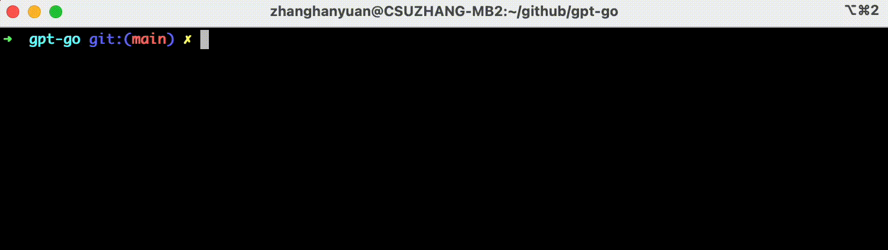

GPT-Go: GPT-4/GPT-3 Go-SDK 客户端, 封装 OpenAI 官方 GPT-4/GPT-3 APIs.
========================

<p align="center">
    <br> <a href="README.md">English</a> | 中文
</p>

[](https://raw.githubusercontent.com/csuzhang/gpt-go/main/LICENSE) 
[](https://pkg.go.dev/github.com/hanyuancheung/gpt-go)
[](https://goreportcard.com/report/hanyuancheung/gpt-go)

OpenAI 官方文档 API 参考: https://platform.openai.com/docs/api-reference/introduction

> **Note**: 项目已支持 GPT-4 API 调用, 请使用 Chat Completions API 模型.

## 快速开始

```shell
# clone 项目代码至本地
git clone https://github.com/hanyuancheung/gpt-go.git

# 进入项目目录
cd gpt-go

# 设置API_KEY为环境变量
export API_KEY={YOUR_API_KEY} chatgpt

# go build example 二进制
make chatgpt-example

# 运行 example
./chatgpt
```

## 运行效果



## SDK 文档

查看 Go 文档以获取有关所提供类型和方法的更详细文档: https://pkg.go.dev/github.com/hanyuancheung/gpt-go

## 支持 API

- [x] list 引擎 API
- [x] Get 引擎 API
- [x] Completion API (是主要的 gpt-3 API)
- [x] 对 Completion API 的流式支持
- [x] 文档搜索 API
- [x] 替换默认 url、用户代理、超时和其他选项

## 贡献者

<a href="https://github.com/hanyuancheung/gpt-go/graphs/contributors">
  
</a>

## 参与贡献

在正式大量开发前, 请在 GitHub 上打开一个 issue 提问.
提交 PR 中的代码必须使用 `gofmt` 进行过滤.

## 证书

这个包是在 MIT 证书获得许可, 有关详细信息, 请参阅许可证.

## 支持

如果本项目对你有帮助, 欢迎点个 ⭐️ 表示支持!
